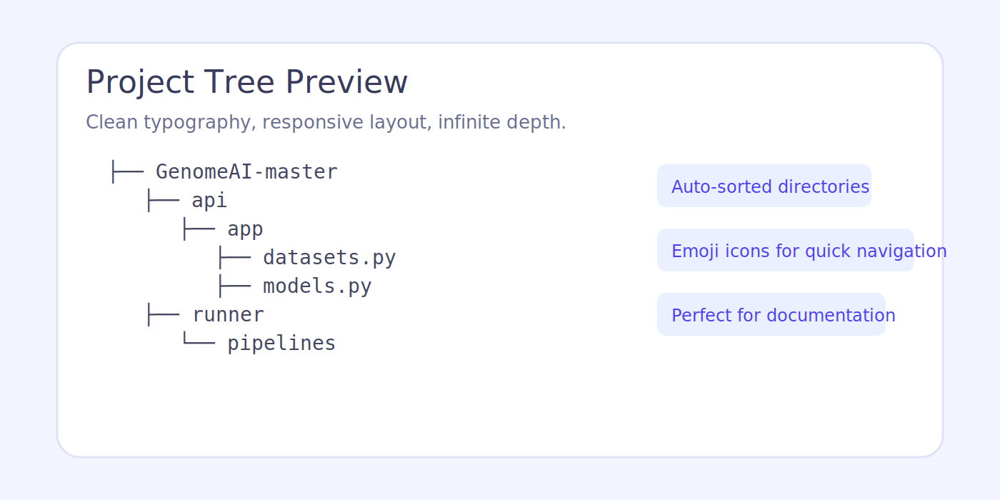
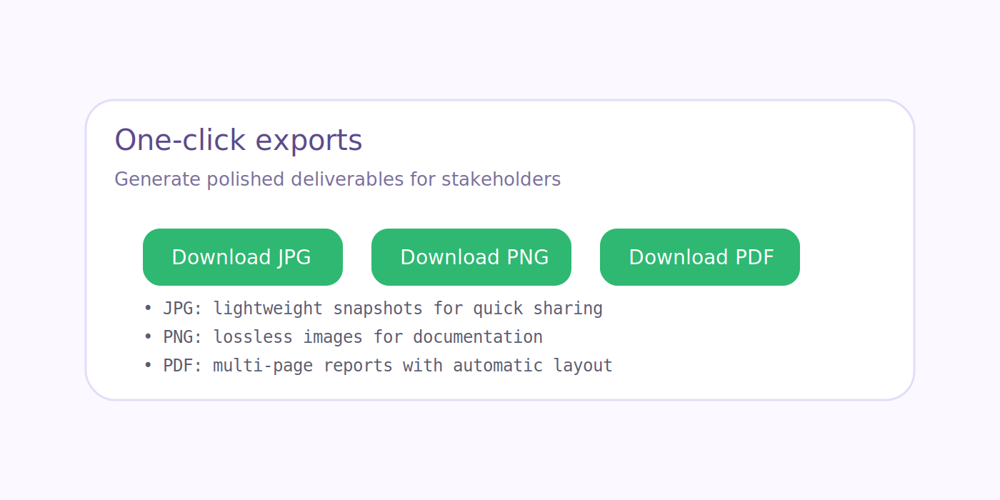

# ZIP Project Tree Visualizer

A cross-platform web tool that accepts any ZIP archive, renders its directory structure as a friendly tree, and lets you export the result as JPG, PNG, or PDF artifacts. Everything runs inside your browser—no server required.

---

## English

### Overview
- Client-side ZIP parsing powered by JSZip and modern JavaScript.
- Accessible UI with drag & drop upload, responsive layout, and keyboard-friendly controls.
- Export suite (JPG / PNG / PDF) with automatic integrity checks and multi-page PDF support.
- Privacy by design: files never leave the browser.

### Project Photos

| Upload Flow | Tree Visualization | Export Controls |
| --- | --- | --- |
|  |  |  |

### Key Features
- Drag & drop ZIP uploads with instant feedback.
- Unlimited archive size (browser memory permitting).
- Deterministic, alphabetically sorted tree with emoji folder/file cues.
- One-click downloads: JPG (lightweight), PNG (lossless), PDF (multi-page).
- Works offline: just open the HTML file.

### Tech Stack
- **Frontend:** Vanilla JS (ES2020), HTML5, CSS3.
- **Libraries:** JSZip, html2canvas, jsPDF.
- **Optional servers:** Python, Node.js, or C++ backend for custom deployments.

### Quick Launch
```powershell
.\launch-browser.ps1
```
or open `frontend/index.html` directly.

### Repository Layout
```
zip-tree/
├── frontend/          # Client-side app (index.html, style.css, app.js)
├── docs/images/       # Documentation images
├── launch-browser.ps1 # 1-click launcher (Windows)
├── launch-web.ps1     # Python helper
├── server.py          # Optional Python server
├── server.js          # Optional Node.js server
├── backend/           # C++ backend prototype (optional)
└── docs               # Additional guides (LAUNCH.md, etc.)
```

### Useful Docs
- `LAUNCH.md` – Step-by-step launch guide (EN/RU).
- `IMPROVEMENTS.md` – Recent feature highlights.
- `BUILD.md` – Native/C++ build details (optional).
- `SETUP_REQUIREMENTS.md` – Dependency notes.

---

## Русский

### Обзор
- Веб-приложение полностью работает в браузере и безопасно обрабатывает ZIP-архивы.
- Поддерживается загрузка перетаскиванием, адаптивный интерфейс и быстрые подсказки.
- Экспорт дерева каталогов в JPG, PNG и PDF (включая многостраничные отчёты).
- Конфиденциальность гарантирована: файлы не покидают компьютер.

### Фотографии проекта

| Форма загрузки | Дерево каталога | Кнопки экспорта |
| --- | --- | --- |
|  |  |  |

### Основные возможности
- Перетаскивание ZIP-файлов с мгновенной проверкой.
- Отсутствует ограничение на размер архива (всё зависит от памяти браузера).
- Отсортированное дерево с иконками папок/файлов.
- Экспорт в JPG (лёгкий), PNG (без потерь) и PDF (несколько страниц).
- Работает офлайн — достаточно открыть HTML-файл.

### Технологии
- **Фронтенд:** чистый JavaScript, HTML5, CSS3.
- **Библиотеки:** JSZip, html2canvas, jsPDF.
- **Опционально:** Python, Node.js или C++ сервер для кастомных сценариев.

### Быстрый старт
```powershell
.\launch-browser.ps1
```
или просто откройте `frontend/index.html`.

### Структура репозитория
```
zip-tree/
├── frontend/          # Клиентское приложение
├── docs/images/       # Скриншоты и иллюстрации
├── launch-browser.ps1 # Запуск в один клик (Windows)
├── launch-web.ps1     # Python-скрипт
├── server.py          # Опциональный сервер на Python
├── server.js          # Опциональный сервер на Node.js
├── backend/           # Прототип на C++
└── docs               # Дополнительные руководства
```

### Полезные файлы
- `LAUNCH.md` – подробная инструкция по запуску (EN/RU).
- `IMPROVEMENTS.md` – список последних улучшений.
- `BUILD.md` – сборка C++-версии.
- `SETUP_REQUIREMENTS.md` – требования к окружению.

---

Happy tree exploring! / Приятного изучения деревьев проектов!
